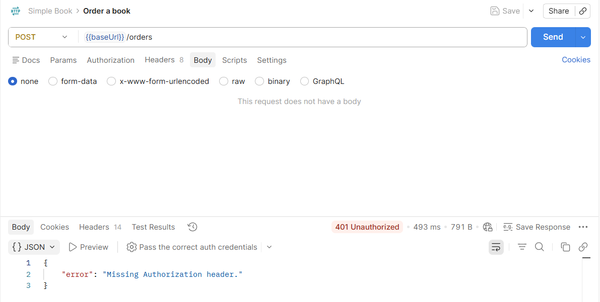
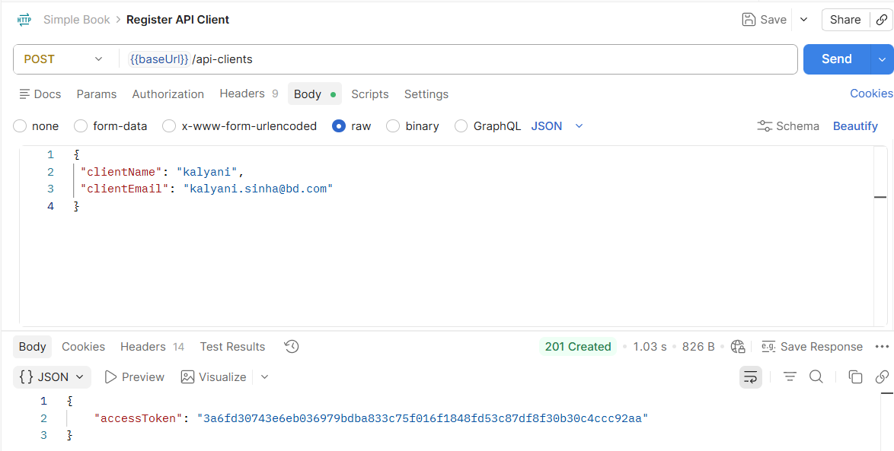

# Order a book

> To order a book, use the POST request
> Use the endpoint /orders to order a book 

> A POST request needs a *body*
>
> If request is sent with out *body*,  a 401 unauthrized error message  is displayed

> This request needs authentication. This is in the documentation
> To submit an order, you need to register your API client

> The purpose is to obtain an access token
> For this we need a POST requst

> The *body* has the reqyuired input details in the JSON format
> The image shows the resposne body tht displays the 201 creted status
> The access token is generated 