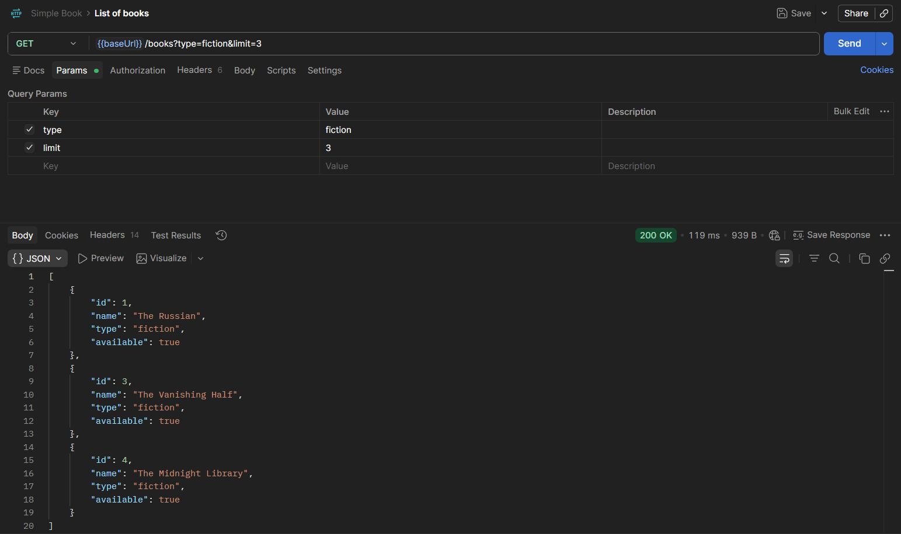
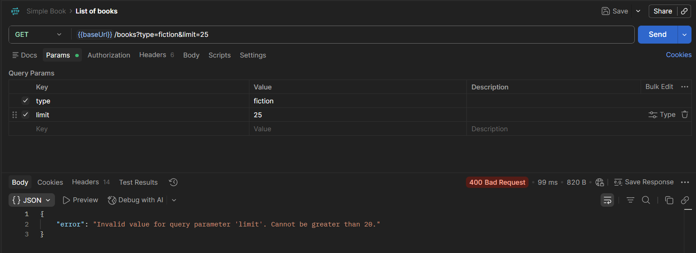

# using other optional query parameter
> Using the `limit` VALUE to query results

> this is the query result when the VALUE used is outside of the accedptable inputs
> See the `status message` - 400 Bad Request

